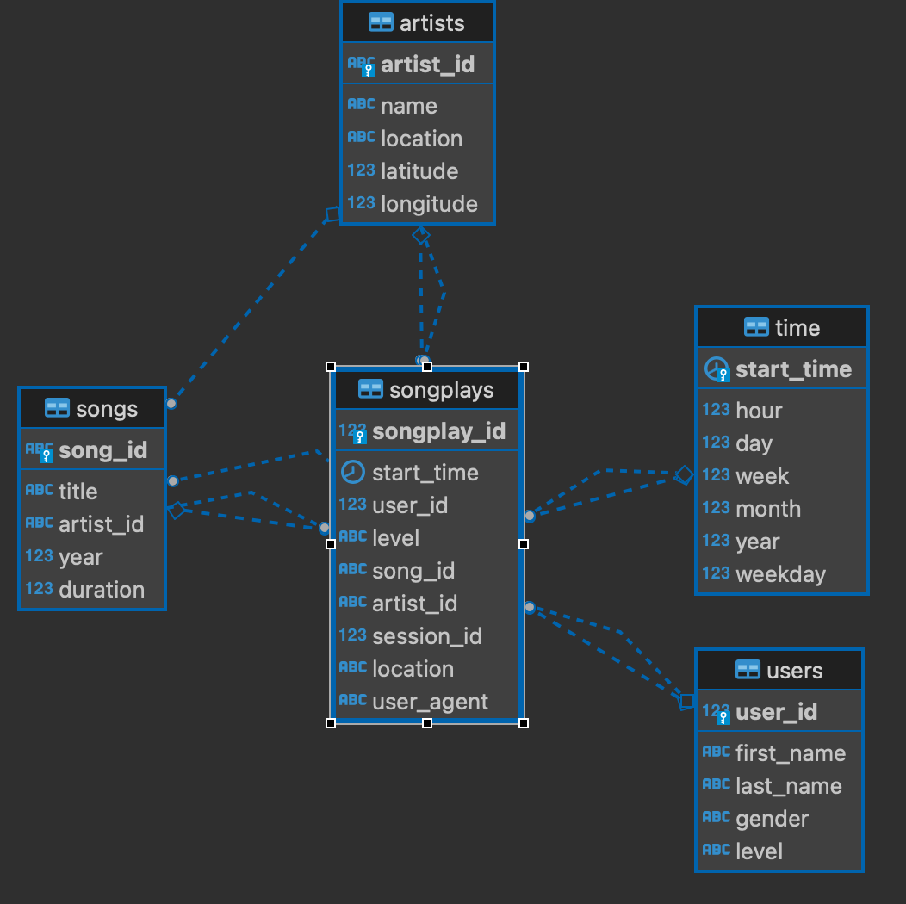

Data Modeling with Postgres
---------------------------

## Introduction

A startup called Sparkify wants to analyze the data they've been collecting on songs and user activity on their new music streaming app. The analytics team is particularly interested in understanding what songs users are listening to. Currently, they don't have an easy way to query their data, which resides in a directory of JSON logs on user activity on the app, as well as a directory with JSON metadata on the songs in their app.

They'd like a data engineer to create a Postgres database with tables designed to optimize queries on song play analysis, and bring you on the project. Your role is to create a database schema and ETL pipeline for this analysis. You'll be able to test your database and ETL pipeline by running queries given to you by the analytics team from Sparkify and compare your results with their expected results.


## Project purpose

The purpose of this project is to be able to analyze the data Sparkify has from user listening to songs. By setting up a relational table it will be much easier to access the data and describe the users behaviour.

### ETL Pipeline

It consists of two steps:

1. Creating the tables

2. Processing data:
	- Processing songs
	- Processing user logs

### 1. Creating the tables

> This part can executed by running in a shell `python create_tables.py`

One fact table for the streaming logs and 3 dimension tables will be created (users, songs, artists and time)

#### Tables Schema

**Fact Table**

1. songplays: it will contain the records in the log data associated with song plays i.e. records with page `NextSong`
`songplay_id, start_time, user_id, level, song_id, artist_id, session_id, location, user_agent`

**Dimension Tables**

2. users: users in the app
`user_id, first_name, last_name, gender, level`

3. songs: songs in music database
`song_id, title, artist_id, year, duration`

4. artists: artists in music database
`artist_id, name, location, latitude, longitude`
5. time: timestamps of records in songplays broken down into specific units
`start_time, hour, day, week, month, year, weekday`


The primary structure of the tables relationship will be a **star schema** (one-to-many), with the fact table **songplays** in the middle, linked to the respective dimension tables by their primary keys:

- **users**: `user_id` (varchar)
- **songs**: `song_id` (varchar)
- **artists**: `artist_id` (varchar)
- **time**: `start_time` (timestamp)



Also, as it can be seen in the image, **songs** and **artists** are linked by the `artist_id` field, so we could also say that the sachema is a **snowflake schema**, where the dimension tables are related to other dimension tables.


### 2. Processing data

>  This part can executed by running in a shell `python etl.py`

The ETL process will access the data stored in `json` files and insert their rows into the tables.


#### Processing songs
This part will read the jsons in `song_data` and save the song info and artist info using the respective queries.

- Folder: `data/song_data/*.json`
- `df[['song_id', "title", "artist_id", "year", "duration"]]` > **songs** table
- `df[['artist_id', "artist_name", "artist_location", "artist_latitude", "artist_longitude"]]` > **artists** table


#### Processing logs
This part will read the jsons in `log_data` and save the songplays info, users info and start_time info using the respective queries.

First, it will be filtered only the log records where the `page=NextSong` (only the info related to songplays).

Then, the information about the `start_time` will be generated: `('timestamp', "hour", "day", "week", "month", "year", "weekday")`, so it can be stored in the **time** table.

Finally, data from users will be inserted into the **users** table.

For the song plays, it will be required to iterate through each record and fetch the **artist_id** and **song_id** so the **songplays** fact table can be linked to the **artists** and **songs** dimension tables.


- Folder: `data/log_data/*.json`
- `('timestamp', "hour", "day", "week", "month", "year", "weekday")` > **time** table
- `ddf[["userId", "firstName", "lastName", "gender", "level"]]` > **users** table
- `(songid, pd.to_datetime(row['ts'], unit='ms'), row.userId, row.level, songid, artistid, row.sessionId, row.location, row.userAgent)]` > **songplays** table


## Project Description

In this project, you'll apply what you've learned on data modeling with Postgres and build an ETL pipeline using Python. To complete the project, you will need to define fact and dimension tables for a star schema for a particular analytic focus, and write an ETL pipeline that transfers data from files in two local directories into these tables in Postgres using Python and SQL.

## Requirements
- python 3.x
- pandas
- psycopg2

## How to run

In a shell window run:

```shell
python create_tables.py
python etl.py
```

## Folder
The project folder contains:

- dataset data:
	- log_data
	- song_data
- `sql_queries.py`: for creating, dropping and inserting elements in the tables
- `etl.py` and `etl.ipnyb`: for the process of selection of columns from song_data and log_data
- `README.md`: project documentation

```shell
root:/home/workspace# tree
.
├── create_tables.py
├── data
│   ├── log_data
│   │   └── 2018
│   │       └── 11
│   │           ├── 2018-11-01-events.json
│   │           ├── ...
│   │           └── 2018-11-30-events.json
│   └── song_data
│       └── A
│           ├── A
│           │   ├── A
│           │   │   ├── TRAAAAW128F429D538.json
│           │   │   ├── ...
│           │   │   └── TRAAAVO128F93133D4.json
│           │   ├── B
│           │   │   ├── TRAABCL128F4286650.json
│           │   │   ├── ...
│           │   │   └── TRAABYW128F4244559.json
│           │   └── C
│           │       ├── TRAACCG128F92E8A55.json
│           │       ├── ...
│           │       └── TRAACZK128F4243829.json
│           └── B
│               ├── A
│               │   ├── TRABACN128F425B784.json
│               │   ├── ...
│               │   └── TRABAZH128F930419A.json
│               ├── B
│               │   ├── TRABBAM128F429D223.json
│               │   ├── ...
│               │   └── TRABBZN12903CD9297.json
│               └── C
│                   ├── TRABCAJ12903CDFCC2.json
│                   ├── ...
│                   └── TRABCYE128F934CE1D.json
├── etl.ipynb
├── etl.py
├── README.md
├── sql_queries.py
└── test.ipynb
```


